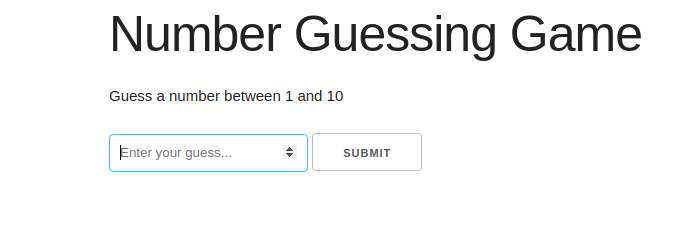
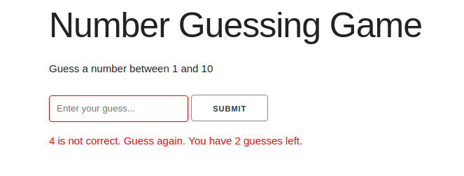
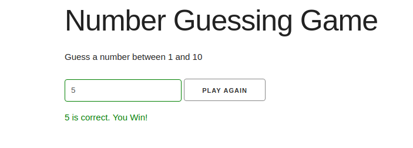

<h1 align="center">Number Guessing Game</h1>

A number guessing game built with JavaScript

## Table of Contents
* [Project Status](#project-status)
* [Features](#features)
* [Screenshots](#screenshots)
* [Technologies](#technologies)
* [Inspirations](#inspirations)
* [Contact](#contact)
* [License](#license)

## Project Status
This project is currently: _In Progress_

## Features
Complete:
* Users have three attempts to guess a random number between 1 and 10
* A message is displayed when a guess is incorrect, and shows the number of guesses remaining
* A winning message is displayed when the user guesses correctly
* A losing message is displayed when the user has no attempts remaining
* The user can choose to play again upon completion of the game

To-Do List:
* Allow the user to specify the minimum and maximum values for the game
* Allow the user to specify the number of attempts for the game
* Utilize local storage to display the user's most recent play attempts (win/lose, number of guesses, etc.)

## Screenshots

## Technologies
Built with:
* HTML
* CSS
* JavaScript

## Inspirations
This project was built as part of Brad Traversy's Udemy course, [Modern JavaScript from the Beginning](https://www.udemy.com/modern-javascript-from-the-beginning/).

## Contact
Twitter - [@CBStanley12](https://twitter.com/CBStanley12)

DEV - [cbstanley12](https://dev.to/cbstanley12)

## License
**MIT License**: 
A short and simple permissive license with conditions only requiring preservation of copyright and license notices. Licensed works, modifications, and larger works may be distributed under different terms and without source code.